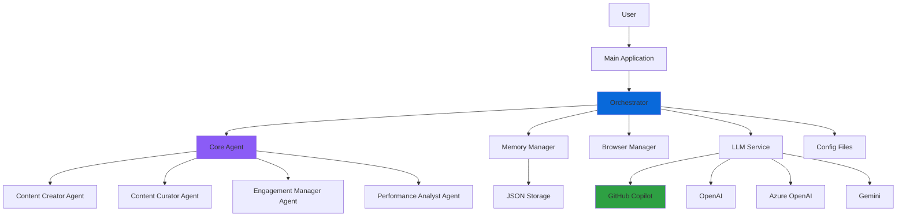
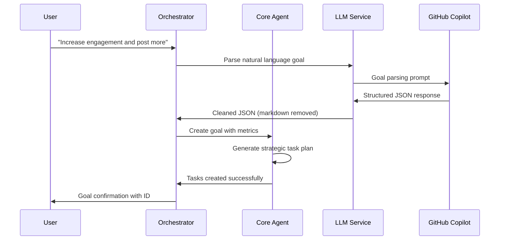
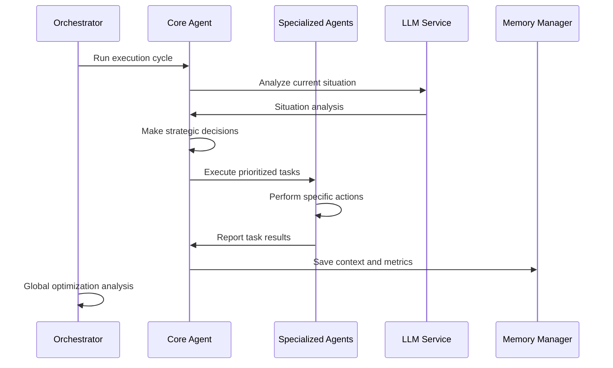
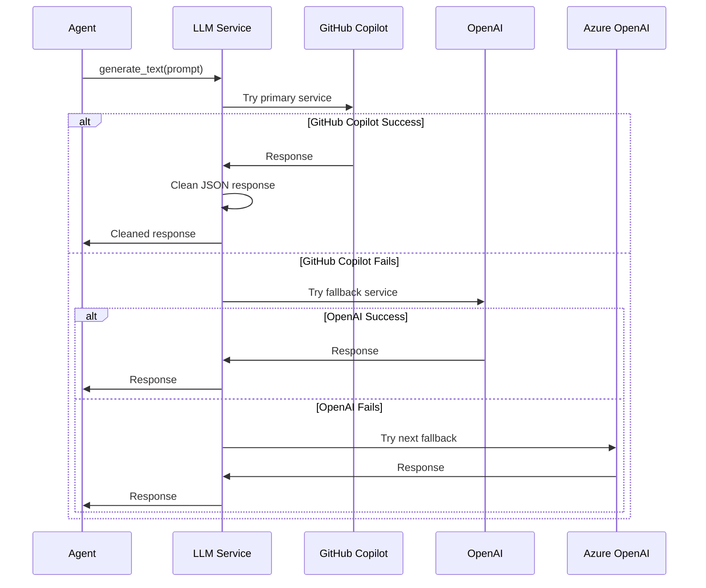

# System Architecture Documentation

## Overview

The Twitter Automation AI is a sophisticated multi-agent system designed to autonomously manage Twitter accounts using artificial intelligence. The system leverages GitHub Copilot as its primary LLM service for intelligent decision-making and strategic planning.

## High-Level Architecture



## Core Components

### 1. Main Application (`main.py`)

**Purpose**: Application entry point and user interface
**Location**: `/main.py`

**Key Responsibilities**:
- System initialization and configuration loading
- Interactive mode management (CLI interface)
- Graceful shutdown handling
- Error handling and logging setup

**Key Methods**:
- `initialize_system()`: Sets up all core components
- `run_interactive_mode()`: Provides CLI interface for user interaction
- `shutdown()`: Handles cleanup and graceful shutdown

### 2. Orchestrator (`src/agents/orchestrator.py`)

**Purpose**: Global coordination and multi-account management
**Location**: `/src/agents/orchestrator.py`

**Key Responsibilities**:
- Coordinate multiple Twitter accounts
- Global optimization across accounts
- Resource allocation and scheduling
- Cross-account performance analysis
- Continuous execution cycle management

**Key Features**:
- **Goal Management**: Parses natural language goals into structured objectives
- **Cycle Management**: Runs automated cycles every configurable interval
- **Global Optimization**: Analyzes performance across all accounts
- **JSON Response Cleaning**: Handles markdown-wrapped responses from LLMs

**Configuration**:
```python
self.cycle_interval = timedelta(minutes=1)  # Configurable cycle timing
self.max_concurrent_accounts = 3
```

### 3. Core Agent (`src/agents/core_agent.py`)

**Purpose**: Individual account intelligence and task management
**Location**: `/src/agents/core_agent.py`

**Key Responsibilities**:
- Goal setting and progress tracking
- Strategic task planning
- Decision making based on situation analysis
- Specialized agent coordination
- Context and memory management

**Agent Roles**:
```python
class AgentRole(str, Enum):
    STRATEGIST = "strategist"
    CONTENT_CURATOR = "content_curator"
    ENGAGEMENT_MANAGER = "engagement_manager"
    PERFORMANCE_ANALYST = "performance_analyst"
    CONTENT_CREATOR = "content_creator"
```

**Key Methods**:
- `set_goal()`: Creates structured goals from natural language
- `plan_for_goal()`: Generates strategic task plans
- `make_decisions()`: Analyzes situations and decides actions
- `analyze_situation()`: Evaluates current account state

### 4. Specialized Agents (`src/agents/specialized/`)

**Purpose**: Task-specific automation capabilities  
**Location**: `/src/agents/specialized/`

The specialized agents have been modularized into separate files for better maintainability:

#### Base Specialized Agent (`base_agent.py`)
```python
class BaseSpecializedAgent(ABC):
    def __init__(self, role, llm_service, browser_manager=None):
        self.memory = {}  # Task execution memory
        self.performance_metrics = {}  # Performance tracking
```

#### Content Creator Agent (`content_creator.py`)
- **Purpose**: Original content generation
- **Capabilities**: Tweet composition, thread creation, brand voice consistency
- **Methods**: `_create_original_tweet()`, `_create_thread()`, `_write_reply()`

#### Content Curator Agent (`content_curator.py`)
- **Purpose**: Content discovery and sharing
- **Capabilities**: Source quality content, competitor analysis, trend monitoring
- **Methods**: `_curate_content()`, `_share_curated_content()`

#### Engagement Manager Agent (`engagement_manager.py`)
- **Purpose**: Community interaction management
- **Capabilities**: Reply management, conversation engagement, relationship building
- **Methods**: `_engage_with_followers()`, `_manage_replies()`

#### Performance Analyst Agent (`performance_analyst.py`)
- **Purpose**: Analytics and optimization
- **Capabilities**: Metrics tracking, performance analysis, strategy optimization
- **Methods**: `_analyze_performance_metrics()`, `_generate_performance_report()`

### 5. LLM Service (`src/core/llm_service.py`)

**Purpose**: Centralized AI service management with intelligent fallback
**Location**: `/src/core/llm_service.py`

**Key Features**:
- **Service Priority**: GitHub Copilot → OpenAI → Azure OpenAI → Gemini
- **Automatic Fallback**: Seamlessly switches between services on failure
- **JSON Response Cleaning**: Handles markdown-wrapped responses
- **Unified Interface**: Consistent API across all LLM providers

**Service Configuration**:
```python
self.service_preference_order = ['copilot', 'azure', 'openai', 'gemini']
```

**GitHub Copilot Integration**:
```python
# Endpoint: https://api.githubcopilot.com/chat/completions
# Model: gpt-4 (default)
# Headers: Authorization, Copilot-Integration-Id
```

### 6. Memory Manager (`src/agents/memory_manager.py`)

**Purpose**: Persistent storage and learning system
**Location**: `/src/agents/memory_manager.py`

**Storage Structure**:
```
agent_memory/
├── contexts/           # Account contexts and state
├── goals/             # Goal tracking and history
└── performance/       # Performance metrics and analytics
```

**Key Capabilities**:
- **Context Persistence**: Saves agent state between sessions
- **Goal Tracking**: Maintains goal history and progress
- **Performance Analytics**: Stores metrics for learning
- **Memory Cleanup**: Manages storage size and retention

### 7. Browser Manager (`src/core/browser_manager.py`)

**Purpose**: Web automation and Twitter interaction
**Location**: `/src/core/browser_manager.py`

**Capabilities**:
- **WebDriver Management**: Chrome/Firefox automation
- **Cookie Management**: Session persistence
- **Anti-Detection**: Headers and behavior randomization
- **Error Handling**: Robust failure recovery

### 8. Configuration System (`src/core/config_loader.py`)

**Purpose**: Configuration management and environment handling
**Location**: `/src/core/config_loader.py`

**Configuration Files**:
- `config/settings.json`: Main system configuration
- `config/accounts.json`: Account-specific settings
- `.env`: Environment variables and API keys

## Data Flow Architecture

### 1. Goal Setting Flow



### 2. Execution Cycle Flow



### 3. LLM Service Flow



## Key Design Patterns

### 1. Agent Pattern
- **Autonomous Agents**: Each agent operates independently
- **Specialized Roles**: Focused responsibilities per agent type
- **Coordination**: Orchestrator manages agent interactions

### 2. Strategy Pattern
- **LLM Services**: Interchangeable AI service providers
- **Task Execution**: Different strategies per agent role
- **Decision Making**: Contextual strategy selection

### 3. Observer Pattern
- **Memory Management**: Agents observe and record actions
- **Performance Tracking**: Continuous monitoring and learning
- **Goal Progress**: Real-time progress tracking

### 4. Command Pattern
- **Task Queue**: Commands represent executable actions
- **Undo/Redo**: Task state management
- **Batch Processing**: Grouped task execution

## Security Considerations

### 1. API Key Management
- Environment variable loading
- Placeholder detection and validation
- Secure storage practices

### 2. Rate Limiting
- Configurable delays between actions
- Respectful API usage patterns
- Automatic backoff on errors

### 3. Browser Security
- Anti-detection measures
- Cookie and session management
- User-agent rotation

## Performance Optimizations

### 1. Async Operations
- All LLM calls are asynchronous
- Concurrent task execution
- Non-blocking I/O operations

### 2. Caching
- WebDriver session persistence
- Configuration caching
- Memory-based state management

### 3. Resource Management
- Configurable concurrent limits
- Memory cleanup routines
- Graceful resource disposal

## Error Handling Strategy

### 1. LLM Service Resilience
- Automatic service fallback
- JSON parsing error recovery
- Response format validation

### 2. Network Resilience
- HTTP timeout handling
- Retry mechanisms
- Connection error recovery

### 3. State Recovery
- Context persistence across restarts
- Goal and task state recovery
- Memory corruption protection

## Monitoring and Logging

### 1. Comprehensive Logging
- Structured log messages
- Component-specific loggers
- Debug information preservation

### 2. Performance Metrics
- Task execution timing
- Success/failure rates
- Resource usage tracking

### 3. Error Tracking
- Exception details and context
- Stack trace preservation
- Error frequency analysis

---

*This architecture supports scalable, intelligent Twitter automation with robust error handling and continuous learning capabilities.*
